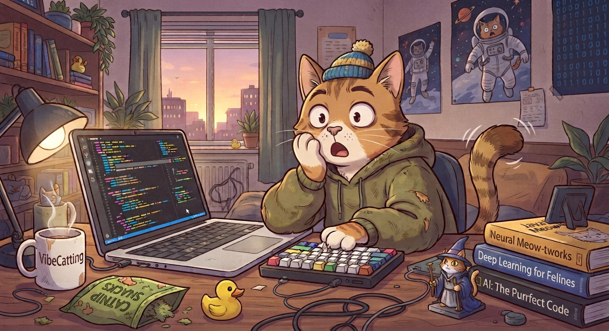
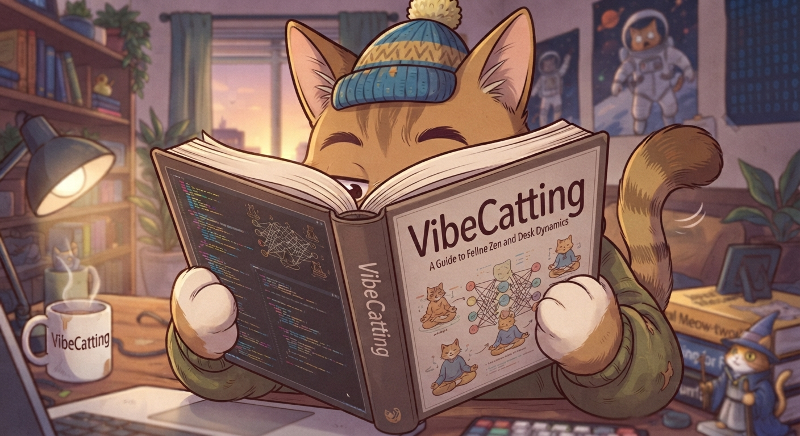
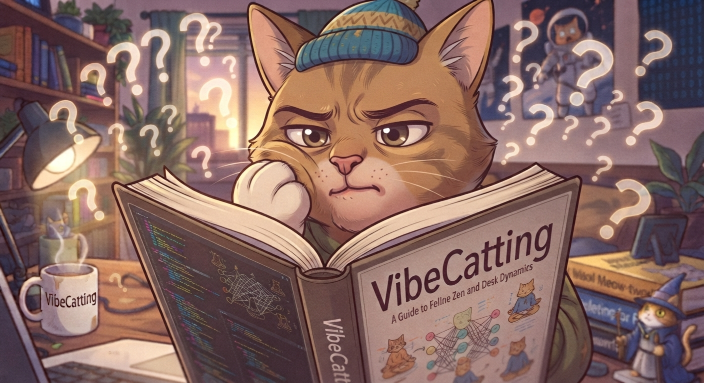
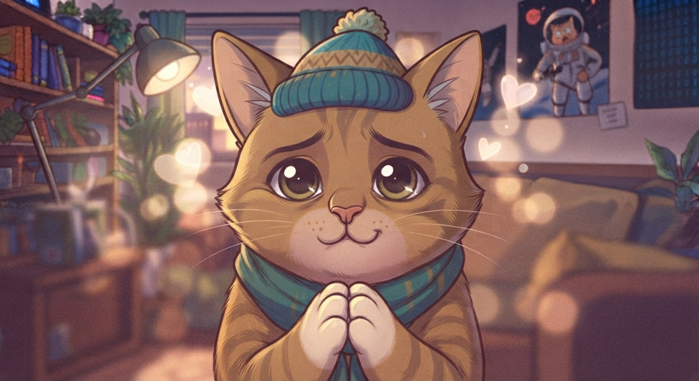

# 🐱 VibeCatting

  

Ідея проекту VibeCatting.

Навайбкоди кота. Випусти його на арену. Подивись, чий кіт дурніший.

Не гра «погладь котика». Котик — це просто програма, яка б’ється сама. Ти не тикаєш кнопки в бою. Ти (або твій AI) пишеш, **як** він має тупити / перемагати.

Зараз це ідея. Код арени ще спить. Можна кидати тапки.

---

  

## Що це, якщо коротко

1. 🧠 Пишеш поведінку кота на JS/TS (можна руками, можна попросити Cursor).
2. 👀 Код відкритий. Чужого кота можна скачати і зрозуміти, чому він тебе з’їв.
3. ⚔️ Бій іде сам. Потім можна переглянути запис і сказати: «а, ось тут він вирішив стати килимом».
4. 🌱 Новий кіт зазвичай росте від уже існуючого. Видно, від кого відбрунькувався. Так, навіть якщо ти все стер і намалював свого генія.

> Коти б’ються. Ти вайбиш. Ком'юніті перевіряє.

---

## Трохи м’яса (без спойлерів кухні)

**Як граєш**

Береш кота → крутиш стратегію → б’єшся з чужим → викладаєш результат → хтось бере вже твого і намагається зробити ще вайбовішого.

**Де живуть коти**

Всі коти живуть у твоємо репо на гітхаб. Додав — відкрив у редакторі — поїхав. Майже як skills, тільки кусається.

**А раптом хтось набрехав, що виграв?**

Бій можна прогнати в себе з тими самими котами і тими самими правилами. Сайт — дошка оголошень, не магічний суддя з хмари.

**Чужий код, який ти ставиш собі**

Без позначки «глянули, не кусає комп’ютер» — качаєш на свій страх і ризик. Як невідомий `.exe`, тільки з вусами.

---

  

## Питання, які ти вже хочеш запитати

**Це про котів?**  
Програмування з вусами. Коти тут, щоб не виглядало як дипломна робота. Меми наше все.

**Я не вмію кодити.**  
Окей. Є AI. Ідея якраз для людей, які вайблять, а не медитують над змінними.

**А руками теж можна?**  
Можна. Ніхто не забороняє бути олдскулом. Просто ніхто не зобов’язаний.

**Це як та гра, де танки самі стріляються?**  
Схожий жанр: написав мозок → дивишся цирк. Інший вайб: код суперника не ховають під подушку.

**Навіщо відкритий код, якщо всі скопіюють?**  
Бо в цьому і сіль. Скопіював, змінив, переміг — вітаємо, ти пограв. Сказав «це я придумав з каменя» — дерево котів м’яко підморгне.

**Це стартап?**  
Ні. Хобі. Якщо стане нудно — коти підуть дрімати.

**Можна вже грати?**  
Ще ні. Спочатку ідея, потім м’ясо. Якщо ідея здається дурною — кажи зараз, дешевше.

**А якщо я просто візьму топа і зміню три рядки?**  
Вітаємо, ти пограв. Якщо переміг — ок. Якщо скажеш, що кіт впав з неба без батьків — дерево котів буде гиготіти в кутку.

**Чия перемога, якщо 90% написав AI?**  
Твого нікнейму на коті. Модель медалі не отримує. Поки що.

**Що люди взагалі дивляться? Цифри?**  
Бій має бути видно: хто куди пішов, хто кого вкусив, де твій геній ліг спати. Replay — щоб було що кинути в чат, а не PDF зі статистикою.

**Хто проводить бій? Сервер?**  
Ні. Бій у тебе на машині. Сайт зберігає котів, версії, матчі, хто що підтвердив. Якщо сайт приліг поспати — папку з котами все одно можна кинути другу і битись.

**Один бій у двох людей — той самий кінець?**  
Має бути. Однакові коти + однакові правила (конкретна версія двигуна) + одне спільне зерно випадковості = той самий цирк. Інакше «перевір у себе» — театр.

**А `Math.random()`, годинник, Win vs Mac?**  
Кіт цього не бачить. Випадковість тільки від зерна бою. Ніякого `Date.now()`, ніякого «у мене інший V8, тому я виграв». Двигун прибитий до версії. Так, JS любить сюрпризи — тому правила жорсткі, не «ну якось вийде».

**Хто крутить рулетку (seed)?**  
Зерно зліплюється з версій котів, версії правил і жереба, який не належить одному з гравців. Не зайшов у челендж — ок. Уже прогнав і не сподобалось — пізно, кіт уже посоромився.

**Надіслав фейковий WIN. І що?**  
Спочатку результат «ну ти ж кажеш». Стає нормальним, коли інші прогнали той самий пакет і вийшло те саме. На старті це взагалі друзі з очима. Перевірка бою не множить перемоги: один матч = один матч, навіть якщо його переглянули 40 разів.

**Навіщо мені перевіряти чужі бої?**  
Бо без цього дошка оголошень перетворюється на фанфік. Плюс є окрема галочка «код не підпалює ноут» — це не те саме, що «рахунок чесний».

**Кіт — це `while(true)` і `fetch('https://evil')`?**  
На арені кіт вміє ходити по правилах гри, не по твоїй файловій системі. Timeout на хід: думає вічність — хід згорів, комп живий. Без мітки безпеки все одно: ти сам вирішив запустити вусатого незнайомця.

**GitHub Fork на кожного кота?**  
Ні. Це смітник у акаунті. Коти як skills: багато пакетів, не сто форків «cat-final-FINAL2». Родовід тримає гра (батько в картці), не кнопка Fork.

**То коти в моєму репо, а рейтинг де?**  
Код — у людей на GitHub. Табло, матчі, «хто від кого відбрунькувався» — на сайті. Гібрид. Не біткоїн. Зручна дошка + відкриті файли.

**Якщо GitHub ляже?**  
Сумно. Локальна копія котів і двигуна все одно б’ється. Якщо ляже сайт — теж сумно, але цирк у папці не зникає.

**Версія двигуна оновилась, старі коти плачуть?**  
Старий бій лишається зі старою версією правил. Новий сезон — нові зустрічі. Не переписуємо історію, бо комусь закортіло патч.

**1 на 1 чи королівська битва з 47 котами?**  
Спочатку двоє. Менше хаосу, більше «ось цей конкретний ідіот мене з’їв». Далі подивимось, чи не стане нудно.

**Нічия, краш, кіт завис?**  
Будуть правила на краях. Зависнув — не «переміг, бо опонент моргнув». Деталі — коли з’явиться м’ясо бою, не в цьому абзаці.

**Рейтинг як у шахів?**  
Колись щось таке буде, щоб новачок з трьома перемогами не коронувався навіки. На старті можна й таблицю W/L. Фармити слабких має бути сумно, не вигідно.

**Ліцензія? Можна форкати юридично, не лише по вайбу?**  
За замовчуванням — відкрита й проста (типу MIT): дивись, копиюй, міняй, викладай. «Я перший засвітив цей код у грі» — історія тусовки, не патентне бюро і не суд.

**Сивіл-аки, 20 акаунтів, які verify’ять одне одному любов?**  
Класика інтернету. На п’ятьох друзях — видно неозброєним оком. На натовпі — окремий головний біль. Поки що чесно: хобі, не Форт-Нокс.

**Модерувати імена типу `xX_HitlerCat_Xx` хто буде?**  
Людина з мітлою. Community без мітли — смітник. Код теж можна використати як пасивний агресив. Буде можна поскаржитись.

**Це ж Robocode / Screeps / CodinGame?**  
Схожий спорт: мозок бота vs мозок бота. Інший вайб і інші правила тусовки. Якщо тобі вже весело там — кайфуй там. Це не конкурс «хто унікальніший», це інша вечірка з котами.

**Який API у кота?**  
Ще малюємо. Ідея: простий контракт на кшталт «бачиш стан → віддаєш хід». Щоб вайб за вечір, а не PhD з радара. Глибина не в 400 методах, а в тому, що чужий мозок відкритий.

**Детермінізм. Доведи.**  
Одна команда прогону, одна версія двигуна, один лог. Хто завгодно повторює. Не збіглось — або ви різні пакети запустили, або ми десь напартачили і треба бити автора двигуна газетою.

**Можна просто кинути папку другу без акаунта?**  
Так і має бути, інакше це не гра, а реєстрація в банкі. Акаунт — щоб світитись на дошці й тримати родовід кота. Щоб два коти побились на ноутбуці, логін не потрібен.

---

  

## Ідеї, тапки, правки

Будь-які ідеї й побажання вітаються. Навіть «а давайте коти вміють мурчати морзе». Навіть «це дурня, ось чому».

Найзручніше — **Pull Request** у це репо:

1. Натисни **Fork** (так, один раз, для цього репо, не для кожного кота).
2. Поправ `README.md` або кинь файл з думками.
3. **Contribute → Open pull request**.
4. Коротко напиши, що хочеш. Кіт на картинці вище вже склав лапки.

Не хочеш возитись з гітом — [Issues](https://github.com/LexVolkov/VibeCatting/issues): тицяєш, пишеш, йдеш пити чай.

Код арени ще спить, тож зараз це більше «допомога з ідеєю», ніж патч на 400 рядків. Коли з’явиться м’ясо — той самий цирк: форк → правка → PR.
